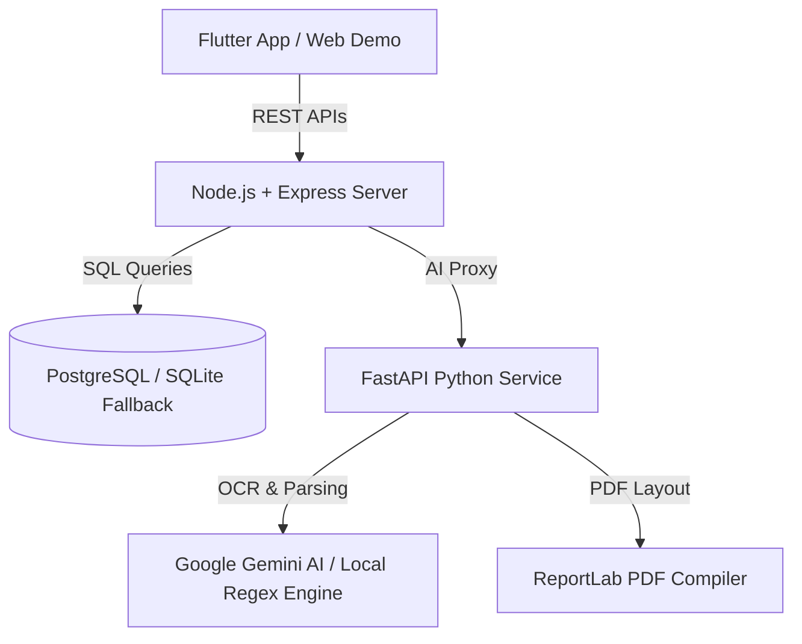

# OneCitizen AI

> "Government should understand citizens. Citizens should not need to understand government departments."

OneCitizen AI is an AI-powered citizen co-pilot that helps users discover government welfare schemes, manage their biometric credentials in a secure cloud vault, automatically pre-screen document mismatches, and auto-fill complex forms, making them 100% submission-ready before visiting a MeeSeva or Common Service Centre (CSC).

---

## 🏛️ Key Features

1. **Citizen Digital Twin**: Stores demographic, socioeconomic, geographic, and family parameters to establish eligibility criteria in the background.
2. **Smart Document Vault**: Secure, encrypted storage for citizen IDs (Aadhaar, PAN, Income, Caste, and Degree certificates).
3. **AI OCR Extraction**: Automatically extracts identity details from uploaded scans and updates the Citizen Digital Twin profile dynamically.
4. **Life Event Routing**: An LLM-based (or local keyword) interface parsing statements like *"I want to open a bakery"* into matching municipal licenses, necessary document lists, and startup grants.
5. **Scheme Recommendations**: Computes dynamic matches based on age, income limits, and occupation rules.
6. **Readiness Score Calculator**: Rates package preparation from 0 to 100%, warning citizens of missing certificates, name mismatches, or expired IDs.
7. **Unified PDF Compiler**: Consolidates forms, validation logs, and verified IDs into a single print-ready PDF application package.
8. **MeeSeva CSC Locator**: Leaflet-mapped finder tracking the closest physical service desks, ratings, and estimated waiting queues.
9. **Admin Registrar Dashboard**: Real-time stats board monitoring registration counts, service volumes, and a *Rejection Prevention Rate* metric.

---

## ⚙️ Architecture & Tech Stack



### Stack Components:
- **Mobile Frontend:** Flutter (Dart) with Riverpod state management.
- **Web Demo Portal:** Single Page App using vanilla HTML, responsive CSS (Smartphone Chassis Viewport), and Leaflet.js.
- **Backend API:** Node.js, Express, Multer (file handling), JWT (auth security), and PostgreSQL (with automatic SQLite fallback).
- **AI Microservice:** Python 3.14, FastAPI, ReportLab (PDF compiler), and Google Generative AI (Gemini 1.5).

---

## 📂 Project Directory Structure

```text
one citizen/
├── backend/
│   ├── routes/
│   │   ├── auth.js            # User Auth & Digital Twin CRUD
│   │   ├── documents.js       # Vault uploads & OCR filling
│   │   ├── services.js        # Catalog search & Readiness score
│   │   ├── meeseva.js         # MeeSeva Center geographic locator
│   │   └── admin.js           # Registrar statistics and audits
│   ├── db.js                  # Dual Postgres/SQLite client wrapper
│   ├── schema.sql             # SQL database definitions
│   ├── verify_backend.js      # Automated integration verification test
│   ├── package.json           # Node.js dependencies
│   └── server.js              # Server entry point
├── ai_services/
│   ├── main.py                # FastAPI server (OCR, validation, ReportLab compiler)
│   └── requirements.txt       # Python package list
├── frontend/
│   ├── lib/
│   │   ├── screens/           # 12 Flutter mobile screens
│   │   ├── services/          # HTTP API client
│   │   └── main.dart          # Entry point, GovTheme, and routing
│   └── pubspec.yaml           # Flutter specifications
└── web_demo/
    ├── index.html             # Phone Simulator / Admin Portal frame
    ├── style.css              # Glassmorphic GovTech UI style sheet
    └── app.js                 # Unified web app logic connecting to API
```

---

## 🚀 Execution & Deployment Guide

### Prerequisites
- Node.js (v18+)
- Python (v3.10+)

---

### Step 1: Start Node.js Backend Server
The backend automatically creates a local SQLite database (`backend/one_citizen.db`) and seeds it with default services, schemes, and MeeSeva centers if no connection string is provided.

1. Navigate to the backend directory:
   ```bash
   cd backend
   ```
2. Install dependencies:
   ```bash
   npm install
   ```
3. Run integration tests (optional):
   ```bash
   node verify_backend.js
   ```
4. Start the server:
   ```bash
   npm start
   ```
   *The backend will boot on port `3000` and also host the static Web Demo portal.*

---

### Step 2: Set Up Python AI Microservice (Optional)
If you want to enable advanced AI OCR parsing, cross-document discrepancies matching, and PDF receipt compilation, launch the FastAPI server.

1. Navigate to the AI directory:
   ```bash
   cd ../ai_services
   ```
2. Create and activate a virtual environment (optional):
   ```bash
   python -m venv venv
   source venv/bin/activate  # On Windows use: venv\Scripts\activate
   ```
3. Install requirements:
   ```bash
   pip install -r requirements.txt
   ```
4. Configure Gemini API key (optional, fallback simulations will run if omitted):
   ```bash
   # Linux/macOS
   export GEMINI_API_KEY="your-gemini-key"
   # Windows PowerShell
   $env:GEMINI_API_KEY="your-gemini-key"
   ```
5. Start the FastAPI microservice:
   ```bash
   python main.py
   ```
   *The Python AI service will run on port `8000`.*

---

### Step 3: Run and View the Interactive Web Demo
1. Open your web browser and navigate to:
   ```text
   http://localhost:3000
   ```
2. Use the **Hackathon Auto-fill Accounts** at the bottom of the login screen:
   - Click **Citizen Account** to instantly log in as a citizen, interact with all 12 mobile screens inside the phone chassis mockup, edit the digital twin profile, upload IDs to the vault, test the MeeSeva maps, and run a readiness check.
   - Click **Admin Account** to explore the registrar dashboard and monitor submission volumes, rejection prevention metrics, and download packages in real-time.
