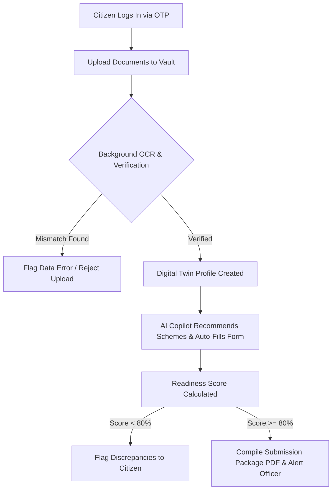

# OneCitizen AI — Project Documentation

OneCitizen AI is a state-of-the-art citizen digital twin and copilot portal designed to simplify, secure, and accelerate government service applications (e.g., MeeSeva certificates in Telangana). It uses artificial intelligence to prevent document mismatch rejections, auto-fill complex forms, and guide citizens through bureaucratic processes.

---

## 🌟 Why This Project Helps & Is Useful

Applying for government services in India often involves high rejection rates, accessibility challenges, and confusion over required documents. OneCitizen AI solves these problems through:

### 1. Rejection Prevention via "Readiness Scoring"
A significant portion of government applications are rejected due to minor discrepancies (e.g., name spellings not matching between Aadhaar and PAN cards, or expired income certificates).
- **The Solution**: Before a citizen submits an application, OneCitizen's backend cross-checks all vaulted documents, fuzzy-matches names using Levenshtein distance, checks expiry dates, and calculates a **Readiness Score**. If discrepancies are found, it flags them immediately, saving citizens weeks of processing delays.

### 2. The Citizen Digital Twin
Citizens can securely upload and store their vital credentials (Aadhaar, PAN, Income, Caste, Birth, and Death certificates) in a digital vault. 
- **The Solution**: Once uploaded, document metadata is parsed and saved. This "Digital Twin" profile is then used to instantly auto-fill official forms, reducing transcription errors to zero.

### 3. AI-Powered Bureaucracy Copilot
Navigating which schemes are available and what documents are required is highly confusing.
- **The Solution**: An integrated Gemini-powered chat assistant guides users through eligibility requirements, recommends relevant welfare schemes, and answers queries using localized context.

### 4. Inclusive Accessibility
- **The Solution**: The portal is fully localized (English, Telugu, Hindi, Urdu) and features voice simulation, making digital governance accessible to elderly, rural, and low-literacy populations.

---

## 🔄 How It Works (User Flow)

The application coordinates frontend interfaces, background OCR validators, and AI engines to guide citizens through a seamless 4-step workflow:

### Step 1: Secure OTP Authentication
Citizens authenticate using their mobile numbers. An OTP is dispatched via Twilio (falling back to a secure development environment log if Twilio credentials aren't configured).

### Step 2: Document Vaulting & OCR Verification
The user uploads documents (e.g., Aadhaar, PAN). 
1. The server runs **Gemini Vision OCR** (falling back to local Tesseract OCR) to extract text.
2. The server extracts the Name, DOB, and ID Numbers.
3. The server runs a **fuzzy verification check** comparing names against the user's profile and Aadhaar card.
4. If there is a mismatch, the upload is rejected to prevent fraud or user error.

### Step 3: AI Consultation & Auto-Fill
Citizens consult the Copilot (e.g., *"I got admission into engineering college"*). The Copilot recommends matching schemes (e.g., Telangana Post-Matric Scholarship) and redirects the user to the application form. The form queries the backend to pull values from the citizen's Digital Twin, instantly pre-populating fields like Aadhaar Number, DOB, and Address.

### Step 4: Readiness Check & Compilation
Upon clicking "Apply", the system performs a final validation. If the score is high, the backend compiles the form data and credentials into a single unified submission package (PDF) and saves it to the registrar queue for administrative approval.

---

## 🛠️ Technical Details & Architecture

### 1. Technology Stack
- **Frontend**: Vanilla HTML5, CSS3 (using CSS variables, glassmorphism design tokens, and CSS hardware-accelerated animations), and asynchronous Vanilla JavaScript (ES6+).
- **Map Visualizations**: Leaflet.js for mapping local MeeSeva service centers.
- **Backend API**: Node.js with Express.
- **Authentication**: Firebase Authentication (compat SDK) and secure phone-based OTP routing.
- **Database Engine**: Dual-mode SQLite (for local development via `one_citizen.db`) and Firestore (for production serverless environments).
- **AI Integration**: Gemini 2.0 Flash API (for chat copilot prompts and Vision OCR document validation).

### 2. Project File Structure
- [index.html](file:///d:/projects/one%20citizen/web_demo/index.html): Core SPA interface, styling nodes, and modals.
- [style.css](file:///d:/projects/one%20citizen/web_demo/style.css): Premium design system including dark-theme overrides, glass containers, scanner lasers, and animations.
- [app.js](file:///d:/projects/one%20citizen/web_demo/app.js): Core SPA controller handling navigation, state machines, API calls, parallel network requests, Leaflet maps, and translation dicts.
- [backend/server.js](file:///d:/projects/one%20citizen/backend/server.js): Entrypoint for the Express API, containing CORS, body size configurations, static routes, and temporary file cleaner.
- [backend/firestore.js](file:///d:/projects/one%20citizen/backend/firestore.js): Abstracted data access layer providing dual-mode SQLite/Firestore fallback wrappers.
- **backend/routes/**:
  - [auth.js](file:///d:/projects/one%20citizen/backend/routes/auth.js): Sign up, email/password, and Firebase token verification.
  - [otp.js](file:///d:/projects/one%20citizen/backend/routes/otp.js): Twilio SMS sender, in-memory rate-limiter, and brute-force protector.
  - [documents.js](file:///d:/projects/one%20citizen/backend/routes/documents.js): File uploading via Multer, Gemini Vision OCR prompts, and Levenshtein name-matching algorithms.
  - [services.js](file:///d:/projects/one%20citizen/backend/routes/services.js): Auto-fill aggregator and application readiness scoring logic.
  - [copilot.js](file:///d:/projects/one%20citizen/backend/routes/copilot.js): Streamlined chatbot system instructions and API queries.
  - [admin.js](file:///d:/projects/one%20citizen/backend/routes/admin.js): Parameterized database dashboard statistics and application queue approvals.

### 3. Security Architecture
- **CORS Whitelisting**: Restricted to whitelisted domains (`ALLOWED_ORIGINS` in `.env`) to prevent unauthorized cross-origin requests in production.
- **Payload Sanitization**: JSON parser body limits are capped at `1mb` to prevent Denial of Service (DoS) attacks.
- **Role Isolation**: Citizen roles are strictly hardcoded to `'citizen'` upon user signup to prevent privilege escalation attacks.
- **Rate-Limiting & Anti-Brute Force**: 
  - OTP requests are rate-limited to 3 times every 5 minutes.
  - Verification tokens are invalidated and locked after 5 failed attempts to block automated brute-force attacks.
- **SQL Injection Defense**: User profiles are updated using whitelisted columns to prevent field-injection exploits. All administrative queries are parameterized.
- **XSS Protection**: All user data displayed dynamically on the frontend via `innerHTML` is routed through the `escapeHTML` sanitizer in `app.js`.
